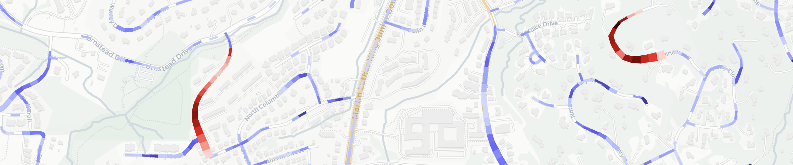

# Steepest Road in Town


A static web app that answers the question: **what's the steepest road in town?**
Enter a place and get a map of roads colored by steepness plus a ranked bar list
of the steepest ones. A handful of inputs (below) tune the search area and how
roads are ranked.

Everything runs in the browser against free public APIs; there is no backend and
no database, so it hosts happily on GitHub Pages —
**[try it live](https://xangregg.github.io/steepest/)**.

Code and docs were largely written using Claude Code (Fable 5 and Opus 4.8).



## Inputs

- **Place** — a town or city name (e.g. `Pittsburgh, PA`) or coordinates like
  `40.44, -79.99`.
- **Radius** — how far out from that center to search, in km (default 5). Larger areas have longer fetch times.
- **Rank by** — which metric orders the list: **Steepest**, **Hardest climb**,
  or **Longest incline** (described below).
- **Top** — how many roads appear in the ranked list (default 15); in
  Hardest-climb mode, also how many climbs are shaded red on the map.
- **Sustained length** — the stretch length steepness is measured over
  (default 250 m). Sampling is at 25 m resolution. Larger values reward long
  climbs.
- **Long incline** — the minimum length for a run to count as a "long incline"
  and get the amber underlay (default 800 m); also the length ranked in
  Longest-incline mode.
- **Over _N_ roads** — Longest-incline mode only: how many connected roads one
  incline may span (default 1); higher lets an incline continue across junctions
  onto adjoining roads.

## How it works (short version)

1. **Geocode** the place name to coordinates (a `lat, lon` input skips this).
2. **Fetch** all drivable OpenStreetMap _ways_ within the radius and stitch them
   into continuous named roads.
3. **Sample** each road's elevation every ~25 m from public terrain tiles,
   correcting bridges, tunnels, and dataset seams.
4. **Rank** three ways:
   - **Steepest** — best average grade over a stretch of the chosen length.
   - **Hardest climb** — an effort score, roughly gain × average grade.
   - **Longest incline** — the longest sustained rise, which may span several
     connected roads.

   A bar chart shows the top-ranked roads; hover to highlight, click to zoom.
5. **Draw** the roads colored by steepness and flared by relative altitude: red
   for the ranked stretches, indigo for others, with an amber underlay for long
   inclines. Click a segment for exact grades.
6. **Cache** the processed results so re-ranking is instant, encode the search in
   the URL for sharing, and export the ranking to CSV.

## How it works (long version)

### Geocoding

[Nominatim](https://nominatim.org/release-docs/latest/api/Search/) turns the
place name into coordinates (a `lat, lon` input skips this).

### Roads

The [Overpass API](https://overpass-api.de/) returns all drivable OpenStreetMap
(OSM) ways within the radius: `residential`, `unclassified`, `living_street`,
`tertiary`, `secondary`, `primary`, and `trunk` (excluding service roads,
tracks, and paths).

- **Stitching.** Ways sharing a name and an endpoint are merged into continuous
  roads, but only when travel continues roughly straight through the join
  (≤ 70° turn) and any TIGER `name_base`/`name_type` tags agree, so distinct
  streets that share such a name don't chain into one fictional road. (TIGER is
  the US Census Bureau's road data, bulk-imported into OSM in 2007 with
  often-mangled names.)
- **Bridges & tunnels.** Their spans are kept for continuity, but their
  elevations are replaced by a straight-line deck between the solid ground at
  each end, so the elevation model reports the gorge under a bridge, not the
  roadway.

### Elevation

Each road is resampled every ~25 m, and elevations come from
[AWS Terrain Tiles](https://registry.opendata.aws/terrain-tiles/) (Mapzen
terrarium PNGs, decoded pixel-by-pixel in a canvas — free, global, no API key),
sampled bilinearly. Roads that cut into terrain are especially susceptible to
errors in local grade calculations. Impossible grade jumps steeper than any real
road are detected and interpolated across; they tend to appear where a road
crosses a seam between the source elevation datasets.

### Metrics

Ranks are based on all the downloaded map data, not just the part in view.

- **Steepest** is the default. It ranks a road by the best average grade it
  holds over any stretch of the chosen length (250 m by default).
  - The length is a knob: 25 m degenerates to "steepest single segment" (noisy;
    treat with skepticism), while longer windows reward genuinely long climbs.
    Roads shorter than the window are excluded, since the metric is undefined for
    them.
  - Rankings are of *stretches*, not whole roads: a road with several steep
    sections can take several list spots, each section's best window competing on
    its own, up to three per road. Sections split where the metric drops below
    the 3 % display floor, or at a marked dip within a steep run.
- **Hardest climb** ranks by effort rather than grade. Each continuous climb on
  a road (in either travel direction) is scored by the **effort integral**
  Σ segment length × grade², which equals gain × average grade on a steady climb
  (the FIETS index from the Dutch cycling magazine *Fiets* uses the same core
  formula), so the same gain over half the distance scores double.
  - A climb tolerates only small counter-slope (≤ max(2 m, 10 % of ascent)), so
    a genuine dip ends one climb and starts another; near-flat tails aren't part
    of the climb, while adjacent climbing that's still real is included even when
    it's gentler than the core.
  - Up to three non-overlapping climbs are extracted per road and all compete
    individually, so a road with two distinct hills can take two list spots
    (same-name entries are deduped geographically, so the two sides of a divided
    road still yield one row per physical climb).
- **Longest incline** ranks by the length of the longest long-incline run: the
  same mostly-monotonic, ≥ 3 % stretches (of at least the "long incline" length)
  that get the amber underlay, measuring how far the hill goes rather than how
  steep it gets.
  - An incline may span several connected roads (the "over N roads" knob): a
    climb that continues across a junction onto a differently-named road is
    followed through a junction graph (built from coincident sample points, so it
    handles a road ending mid-way along the next) and reported as one incline,
    e.g. "Burrell Mountain Rd + Whitmire St".
  - A bounded search over chained road slices runs the same grind rule on each
    chain's combined elevation profile; results are de-duplicated by physical
    extent (no stretch of pavement appears in two inclines, and a multi-road
    incline supersedes its single-road pieces), but a road with several distinct
    inclines ranks each one, so two inclines climbing away from a valley floor
    (or meeting at a summit) both appear.

Changing mode or window re-ranks instantly from cached elevation profiles.

### Caching

Processed results (roads with elevation profiles) are cached in IndexedDB per
location+radius for two weeks, so repeat searches skip Overpass and tile
sampling entirely; a "refresh from OSM" link in the status line forces a
refetch. Geocode lookups are cached in localStorage.

### Rendering

[Leaflet](https://leafletjs.com/) — a third-party JavaScript map-rendering
library, loaded at runtime from a CDN (only its `@types/leaflet` type stubs live
in `node_modules`) — draws the roads with its canvas renderer over a CARTO
basemap, colored on a fixed 3–25 % single-hue gradient so a given color means the
same grade in every town.

- **Localized color.** Coloring is fully segment-level: every ~25 m segment
  wears its own local grade, so paint never claims steepness the ground doesn't
  have, and below 3 % it goes unpainted. Inside a ranked climb, incline, or
  stretch, any sub-3 % spot is lifted to the palest step so the band stays
  continuous — its steeper segments still show through. The map shows where the
  hills are, and a long road fades in and out with its actual climbs instead of
  wearing its single best grade everywhere.
- **Long-incline underlay.** Mostly-monotonic stretches at least the "long
  incline" length (default 800 m) and averaging ≥ 3 % get a continuous
  translucent amber underlay beneath the ribbons, so a mile-long 3 % incline is
  acknowledged instead of invisible; its width flare accumulates over the whole
  incline. An incline crossing junctions onto connected roads is drawn as a
  single unbroken amber ribbon (a synthetic "virtual road" spanning its exact
  extent) in every mode, so the amber matches the inclines the ranking finds.
- **Red marks the ranking, indigo marks the rest.** In every mode the ranked
  (top-N) extents wear the red gradient and all other steep road wears a
  contrasting indigo one (same 3–25 % scale), so map color mirrors the ranking.
  - *Hardest climb.* The listed climbs are red; each stays one unbroken band,
    its segments showing their own grades with any sub-3 % spot inside lifted to
    the palest step so the band never breaks.
  - *Steepest.* Red marks each ranked stretch, extended along its shoulders
    (connected segments whose sustained grade stays within ~80 % of the
    stretch's own, and above 3 %), so nearly-as-steep road on either side reads
    as part of the red section rather than an indigo fringe.
  - *Longest incline.* Each ranked incline's exact extent, across every road it
    spans, wears red (floored at the palest red where the incline's grade dips
    below the 3 % color scale), largely covering its amber underlay.
- **Other steep roads have no length threshold.** Any single ~25 m segment at
  ≥ 3 % shows in indigo, so a short steep pitch too brief to rank still appears,
  without changing which roads make the list. Clicking a segment reports its own
  grade and the sustained grade at the chosen length, showing how far it falls
  short of ranking.
- **Sidebar & sharing.** The bar chart shares the color gradient and doubles as
  the ranked list; hover to highlight on the map, click to zoom. A "Download CSV"
  button exports the current ranking (begin/end lat/lon/elevation per stretch,
  columns tailored to the mode). Searches are encoded in the URL hash so results
  are shareable, and light/dark themes follow the OS.

## Code tour

- `roads.js` — geocoding (Nominatim, localStorage-cached), the streaming
  Overpass fetch with mirror retries, and way stitching: same-name ways merge
  where travel continues straight through the join (bearing gate), TIGER
  `name_base`/`name_type` tags must agree, and three-end junctions (a two-way
  road becoming a divided road) merge their straightest pair. Bridge/tunnel
  points are flagged for elevation correction.
- `elevation.js` — terrarium PNG tile decoding and bilinear sampling, with a
  module-level tile cache and a pluggable decoder (canvas in the browser,
  pngjs in Node tests).
- `metrics.js` — all profile math; see its header for conventions. Tunable
  thresholds live as documented constants at the top of each section.
- `render.js` — ribbon drawing, hue rules, legend, popups; see its header for
  the full rendering model.
- `cache.js` — IndexedDB persistence of processed roads (versioned; bump
  `VERSION_TAG` when the processed shape or pipeline output changes).
- `csv.js` — builds the "Download CSV" export of the current ranking; the
  columns differ by mode (climb rows carry each climb's score/gain and its
  bottom→top endpoints; sustained rows carry the best-window endpoints), with
  begin/end lat/lon/elevation for the ranked stretch.
- `app.js` — UI wiring and orchestration; its header documents the road
  object's field lifecycle. Also exposes the `window.steepest` dev hook for
  live style experiments.
- `test/unit.test.mjs` — network-free checks on synthetic profiles (the default
  `npm test`); `test/live.test.mjs` is the on-demand end-to-end run against real
  Nominatim/Overpass/tiles (`npm run test:live`), and `test/assert.mjs` is the
  shared assert. `test/render.html` is a visual fixture of synthetic roads
  exercising every rendering rule; `test/cache.html` and `test/cache-unit.html`
  cover the IndexedDB cache in a real browser. `test/make-fixture.mjs` captures a
  real search into `test/fixtures/<name>.json` (e.g. the committed
  `brevard.json`), which the app renders offline via `#fixture=<name>` — for
  checking the UI without Overpass.

## Running locally

Browsers block ES modules from `file://`, so serve the directory:

```sh
npm start          # python3 -m http.server 8080
open http://localhost:8080
```

### Offline preview

`#fixture=brevard` renders a saved Brevard search
(`test/fixtures/brevard.json`) with no Nominatim/Overpass/tile-metadata calls —
useful for demos or UI work when the public APIs are slow, e.g.
`http://localhost:8080/#fixture=brevard`. Capture more (or refresh this one)
with `node test/make-fixture.mjs "<place>" <radius_m> <name>` when Overpass is
responsive.

## Testing

`npm test` runs the network-free unit checks (stitching, resampling, the metric
and climb math, long-incline masking, multi-road incline paths, bridge/tunnel
interpolation, CSV export) on synthetic profiles — fast and safe for CI, no
network needed.

`npm run test:live` runs the on-demand end-to-end check: a real
Nominatim/Overpass/terrain-tile run against a small town (`pngjs` stands in for
the browser's canvas decoder), so it needs network access and is subject to the
public servers' rate limits. `npm run test:all` runs both.

All of them need `npm install` once (for `pngjs`).

## Deploying to GitHub Pages

Push to GitHub, then Settings → Pages → deploy from branch `main`, root folder.
No build step. This repo is live at <https://xangregg.github.io/steepest/>.

## Known limitations

- The digital-elevation-model (DEM) is ~10–30 m resolution: on switchbacks or roads cut into steep
  hillsides, samples can catch the hillside instead of the roadbed and overstate
  grades (longer sustained windows resist this; short ones don't).
- Public Overpass servers rate-limit; big-city searches at large radii can be
  slow or need a retry (the app retries mirrors automatically).
- "Town" is approximated by a radius around the geocoded center rather than
  actual municipal boundaries.
